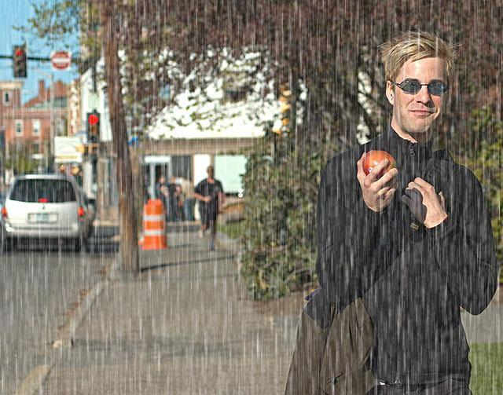
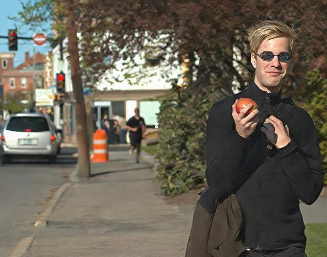

# ClearView: Neural Image Deraining

[](https://www.python.org/downloads/)
[](https://pytorch.org/)
[](https://opensource.org/licenses/Apache-2.0)
[](https://huggingface.co/spaces/dronefreak/clearview-derain-demo)

**Fast and practical deep learning model for removing rain streaks from images using PyTorch.**

Designed for autonomous driving perception, surveillance systems, and image restoration. Built with production-ready architectures and real-time inference capabilities.

---

## 🎯 Features

- **Multiple Architectures**: U-Net, Attention U-Net with clean implementations
- **Flexible Loss Functions**: L1, L2, SSIM, Edge, Perceptual losses (individual or combined)
- **Interactive Demo**: Try it live on [HuggingFace Spaces](https://huggingface.co/spaces/dronefreak/clearview-derain-demo)
- **Production Ready**: Mixed precision training, gradient clipping, early stopping
- **Easy to Use**: Simple CLI interface with sensible defaults
- **Comprehensive Metrics**: PSNR, SSIM, MAE, MSE tracking during training
- **Pretrained Models**: Download trained weights from [HuggingFace Hub](https://huggingface.co/dronefreak/clearview-derain-unet)

---

## 🚀 Quick Start

### Installation

```bash
# Clone the repository
git clone https://github.com/dronefreak/clearview.git
cd clearview

# Install dependencies
pip install -r requirements.txt

# Install as editable package
pip install -e .
```

### Try the Interactive Demo

**Online (no installation required):**
Try the model now: [🚀 Live Demo on HuggingFace](https://huggingface.co/spaces/dronefreak/clearview-derain-demo)

**Local:**

```bash
python scripts/gradio_demo.py --weights path/to/checkpoint.pth
# Opens in browser - drag and drop rainy images for instant results
```

### Inference on a Single Image

```bash
clearview-infer \
    --image rainy_image.jpg \
    --weights clearview-unet.pth \
    --output derained.jpg
```

### Training Your Own Model

```bash
clearview-train \
    --data-dir /path/to/Rain1400 \
    --output-dir experiments/my_model \
    --model unet \
    --loss l1 \
    --optimizer adamw \
    --lr 1e-4 \
    --epochs 200 \
    --batch-size 24 \
    --dataset-type rain1400
```

---

## 📊 Results

### Quantitative Performance

Trained on **Rain1400** dataset (12,600 training pairs, 1,400 test pairs):

| Model          | Loss | Test PSNR | Test SSIM | Params | Speed (ms) |
| -------------- | ---- | --------- | --------- | ------ | ---------- |
| UNet           | L1   | **30.91** | **0.914** | 7.8M   | ~15        |
| Attention UNet | L1   | 30.04     | 0.910     | 8.9M   | ~20        |

_Speed tested on NVIDIA RTX 4070 Super, 256×256 crops, batch size 1_

**Key Findings:**

- ✅ **L1 loss outperforms multi-component losses** for this task
- ✅ **Vanilla UNet matches Attention UNet** with fewer parameters
- ✅ **High SSIM (0.914)** indicates excellent structural preservation

### Visual Quality

<table>
<tr>
<td>
  <br/>
  <b>Input (Heavy Rain)</b>
</td>
<td>
  <br/>
  <b>Output (Derained)</b>
</td>
</tr>
</table>

**Strengths:**

- Removes heavy rain streaks effectively
- Preserves facial features and structural details
- Natural color reproduction
- No obvious artifacts

**Limitations:**

- Slight smoothing of fine textures (grass, branches)
- Trained on synthetic rain (may not generalize to all real-world scenarios)

---

## 🏗️ Architecture

### UNet (Recommended)

```text
Input (3×H×W)
    ↓
[Encoder: 4 DoubleConv blocks]
    ↓ [MaxPool after each]
[Bottleneck: DoubleConv]
    ↓
[Decoder: 4 TransposeConv + DoubleConv blocks]
    ↓ (skip connections from encoder)
[Output: Conv2d + Sigmoid]
    ↓
Output (3×H×W) ∈ [0,1]
```

**Key Design Choices:**

- Simple conv blocks (no ResNet/EfficientNet needed for good performance)
- Sigmoid activation to bound outputs to [0,1]
- Skip connections for detail preservation

### Loss Function

After extensive experimentation, **L1 loss alone** performs best:

```python
loss = L1(pred, target)  # Simple pixel-wise L1
```

**What I tried:**

- ❌ L1 + L2 + SSIM + Edge + Perceptual → **Worse** (23-25 PSNR)
- ❌ L1 + SSIM (weight 0.5) → **Worse** (22 PSNR)
- ❌ L1 + SSIM (weight 0.01) → **Worse** (27 PSNR)
- ✅ **L1 only** → **Best** (30.9 PSNR)

---

## 📁 Project Structure

```bash
clearview/
├── clearview/              # Core library
│   ├── models/             # UNet, Attention UNet
│   ├── losses/             # Loss functions
│   ├── data/               # Dataset loaders (Rain100, Rain1400, custom)
│   ├── training/           # Trainer, callbacks, schedulers
│   └── utils/              # Metrics, conversions, logging
├── scripts/                # Command-line tools
│   ├── train.py            # Training script
│   ├── evaluate.py         # Evaluation script
│   └── inference.py        # Single image inference
├── configs/                # YAML configuration examples
├── tests/                  # Unit tests
└── docs/                   # Documentation
```

---

## 📚 Datasets

### Supported Datasets

- **Rain100H**: 1,800 train / 100 test (heavy rain)
- **Rain100L**: 200 train / 100 test (light rain)
- **Rain1400**: 12,600 train / 1,400 test (**recommended**, used for pretrained model)
- **Custom datasets**: Easy to add with CSV file mapping

### Dataset Preparation

Organize your data:

```bash
dataset/
├── train/
│   ├── rainy_image/
│   │   ├── 001.jpg
│   │   └── ...
│   └── ground_truth/
│       ├── 001.jpg
│       └── ...
└── test/
    ├── rainy_image/
    └── ground_truth/
```

**For Rain100H/L:**

```bash
clearview-train \
    --data-dir /path/to/Rain100L \
    --dataset-type rain100 \
    ...
```

**For Rain1400 or custom:**

```bash
clearview-train \
    --data-dir /path/to/dataset \
    --train-rainy train/rainy_image \
    --train-clean train/ground_truth \
    --val-rainy test/rainy_image \
    --val-clean test/ground_truth \
    --dataset-type rain1400 \
    ...
```

---

## 🎓 Training

### Basic Training (Recommended Settings)

```bash
clearview-train \
    --data-dir /path/to/Rain1400 \
    --output-dir experiments/unet_rain1400 \
    --model unet \
    --loss l1 \
    --optimizer adamw \
    --lr 1e-4 \
    --epochs 200 \
    --batch-size 24 \
    --crop-size 256 \
    --early-stopping \
    --patience 50 \
    --mixed-precision \
    --gradient-clip 1.0 \
    --scheduler plateau \
    --dataset-type rain1400
```

**Training tips based on our experiments:**

- ✅ Use **L1 loss only** for best results
- ✅ Batch size 24-48 works well on modern GPUs
- ✅ Early stopping patience 30-50 for large datasets
- ✅ Mixed precision speeds up training without quality loss
- ❌ **Avoid** complex multi-component losses unless carefully tuned
- ❌ **Avoid** attention mechanisms (no benefit for this task) - TBD

### Training Time

On **RTX 4070 Super (12GB)**:

- Rain100L (200 images): ~1 sec/epoch → ~10 minutes total
- Rain1400 (12,600 images): ~2 min/epoch → ~6-7 hours total

### Monitor Training

Check logs:

```bash
tail -f experiments/unet_rain1400/training.log
```

View training curves:

```bash
# Automatically generated after training
open experiments/unet_rain1400/training_curves.png
```

---

## 🔬 Evaluation

### Evaluate on Test Set

```bash
clearview-eval \
    --weights experiments/unet_rain1400/checkpoints/final.pth \
    --data-dir /path/to/Rain1400 \
    --split test \
    --output-dir results/
```

**Output:**

```bash
PSNR: 30.9058 (±2.1550, min=25.6811, max=38.0960)
SSIM: 0.9137 (±0.0259, min=0.8308, max=0.9673)
MAE: 0.0214 (±0.0056, min=0.0092, max=0.0399)
MSE: 0.0009 (±0.0005, min=0.0002, max=0.0027)
```

Derained images saved to `results/`

---

### Video Processing (Coming Soon)

Frame-by-frame video deraining:

```bash
python scripts/video_demo.py \
    --video rainy_dashcam.mp4 \
    --weights checkpoint.pth \
    --output clean_video.mp4
```

**Note:** Currently processes frames independently (no temporal consistency).

---

## 🚗 Use Cases

### Autonomous Driving

```python
from clearview.models import UNet
import torch
from PIL import Image

# Load model
model = UNet()
checkpoint = torch.load('clearview-unet.pth')
model.load_state_dict(checkpoint['model_state_dict'])
model.eval()

# Process dashcam frame
frame = Image.open('dashcam_frame.jpg')
# ... preprocessing ...
with torch.no_grad():
    clean_frame = model(input_tensor)
# ... postprocessing ...
```

### Surveillance Enhancement

Process video streams in real-time:

```python
for frame in video_stream:
    derained = model.process(frame)
    # Feed to object detection/tracking
```

### Photo Restoration

```bash
clearview-infer --image vacation_photo.jpg --output enhanced.jpg
```

---

## 📦 Pretrained Models

Download from Hugging Face

| Model     | Dataset  | PSNR  | Download                                                                                                                                                                                  |
| --------- | -------- | ----- | ----------------------------------------------------------------------------------------------------------------------------------------------------------------------------------------- |
| UNet (L1) | Rain1400 | 30.91 | [](https://huggingface.co/dronefreak/clearview-derain-unet) |

**Usage:**

```python
from huggingface_hub import hf_hub_download

weights = hf_hub_download(
    repo_id="dronefreak/clearview-unet",
    filename="clearview-unet.pth"
)
```

---

## 🤝 Contributing

Contributions welcome! Areas for improvement:

- ResNet/EfficientNet encoder implementation
- Video temporal consistency
- Real-world rain dataset curation
- Mobile deployment (ONNX, TensorRT)

See [CONTRIBUTING.md](CONTRIBUTING.md) for guidelines.

---

## 📖 Citation

```bibtex
@software{saksena2025clearview,
  author = {Saksena, Saumya Kumaar},
  title = {ClearView: Practical Image Deraining with PyTorch},
  year = {2025},
  url = {https://github.com/dronefreak/clearview},
  note = {Trained on Rain1400, 30.9 PSNR / 0.914 SSIM}
}
```

---

## 📄 License

Apache License 2.0 - see [LICENSE](LICENSE)

---

## 🙏 Acknowledgments

- U-Net architecture: Ronneberger et al., 2015
- Rain1400 dataset: Fu et al., 2017
- Inspired by classical deraining methods and modern deep learning approaches

---

## 🐛 Known Issues & Roadmap

### Current Limitations

- ❌ No temporal consistency for video (frame-by-frame only)
- ❌ Slight texture smoothing on fine details
- ❌ Trained on synthetic rain (may not generalize to all real-world scenarios)
- ❌ CPU inference is slow (~1-2 sec/image)

### Roadmap

- [ ] **ResNet encoder** for 32+ PSNR
- [ ] **Temporal consistency** for video deraining
- [ ] **Real-world rain dataset** collection and training
- [ ] **Mobile deployment** (ONNX, CoreML, TensorRT)
- [ ] **Larger crop sizes** (384×384, 512×512) with resize handling
- [ ] **Snow/fog/haze removal** support
- [ ] **Docker container** for easy deployment

---

## 📞 Contact

- **Author**: Saumya Kumaar Saksena
- **GitHub**: [@dronefreak](https://github.com/dronefreak)
- **Issues**: [GitHub Issues](https://github.com/dronefreak/clearview/issues)
- **Demo**: [HuggingFace Space](https://huggingface.co/spaces/dronefreak/clearview-demo)

---
